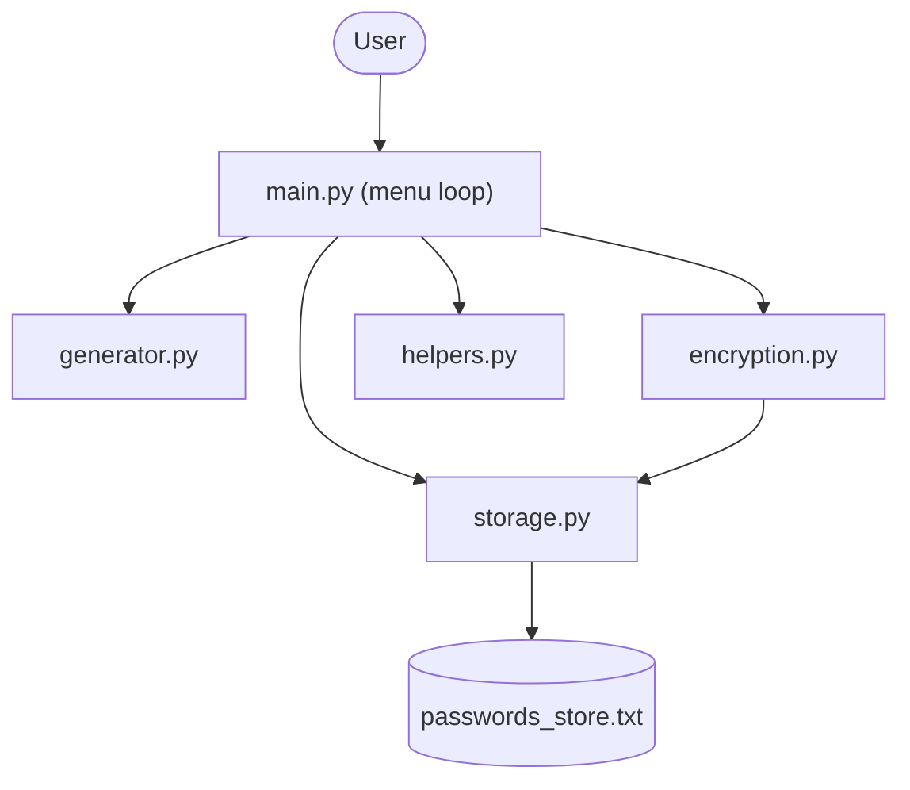
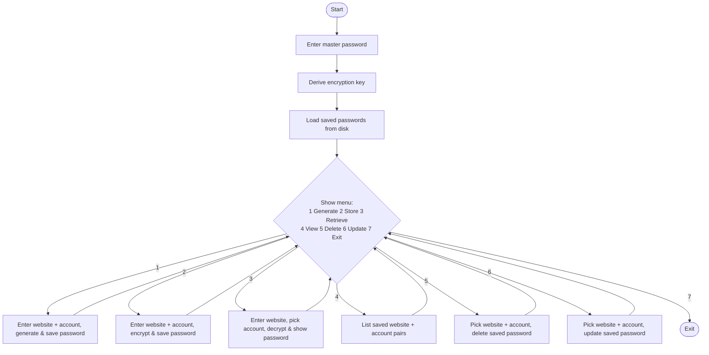
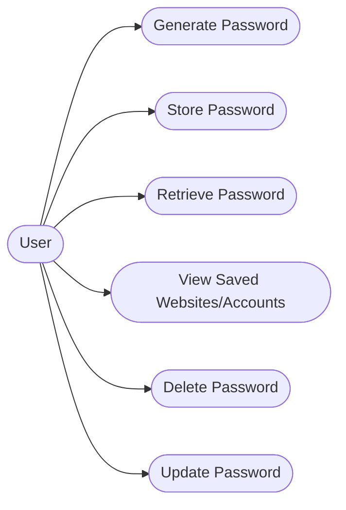
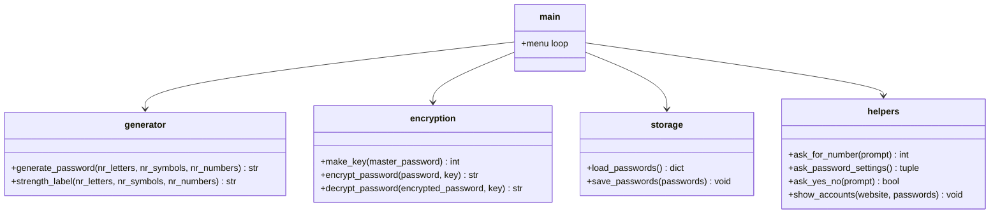
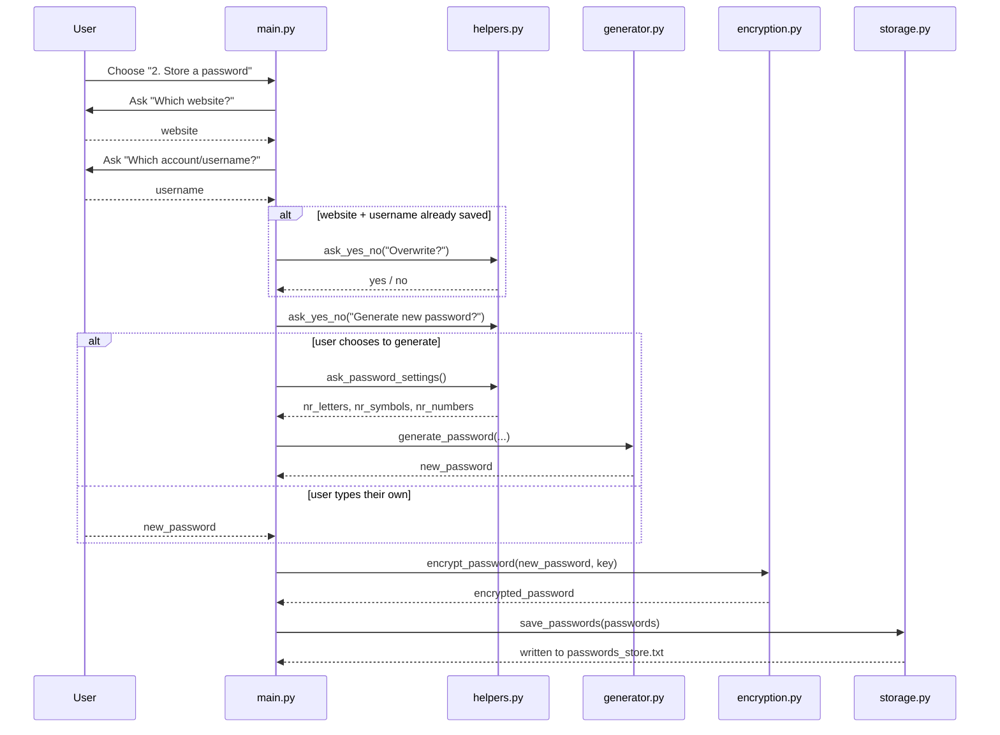
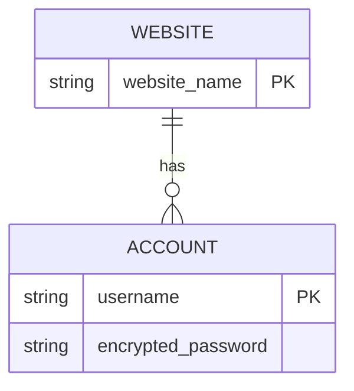

# Design Documentation

## 1. Problem Statement

See [statement.md](../statement.md) for the full problem statement, scope,
target users and high-level features.

## 2. Objectives

- Provide a way to generate strong, random passwords without relying on an
  external service or library
- Demonstrate and use basic encryption/decryption concepts by encrypting stored
  passwords with a key derived from a user-chosen master password
- Store passwords using simple file I/O and a nested dictionary (website -> account/username -> password)
- Support multiple accounts under the same website (e.g. more than one
  Gmail address under "google")
- Provide a clear, validated, menu-driven interface connecting all of the
  above into one program

## 3. Functional Requirements

| ID | Requirement |
|----|-------------|
| FR1 | The system shall generate a password from a user-specified number of letters, symbols, and numbers. |
| FR2 | The system shall reject a password request where the total requested length is 0. |
| FR3 | The system shall allow the user to store a password (typed or generated) against a website name **and** an account/username. |
| FR4 | The system shall encrypt a password before writing it to disk, and decrypt it only when it is retrieved. |
| FR5 | The system shall ask for confirmation before overwriting an existing saved website+account password. |
| FR6 | The system shall allow the user to retrieve, update, delete, and list stored website/account entries. |
| FR7 | The system shall support more than one account/username under the same website. |
| FR8 | The system shall persist stored passwords between separate runs of the program. |
| FR9 | The system shall validate numeric and text input, and re-prompt on invalid input rather than crashing. |

## 4. Non-Functional Requirements

| ID | Category | Requirement |
|----|----------|-------------|
| NFR1 | Security | Passwords are never written to disk in plain text; they are always encrypted first, using a key derived from the master password. |
| NFR2 | Usability | The program uses a numbered menu and plain-language prompts so it can be used without reading documentation. |
| NFR3 | Reliability | Invalid input (non-numeric answers) is caught and re-prompted instead of crashing the program. |
| NFR4 | Maintainability | Functionality is split into single-purpose modules (`generator.py`, `encryption.py`, `storage.py`, `helpers.py`) so each part can be changed independently. |
| NFR5 | Scalability | The nested dictionary structure (website -> account -> password) allows an unlimited number of accounts per website without any change to the storage format. |

## 5. System Architecture Diagram



## 6. Process Flow / Workflow Diagram



## 7. UML Diagrams

### 7.1 Use Case Diagram (simplified)



### 7.2 Class / Component Diagram



### 7.3 Sequence Diagram (Store a Password)



## 8. Storage / Schema Design

There is no database in this project — storage is a nested dictionary
persisted to a text file, which is intentional given the "nothing too
crazy" / no-external-libraries scope of the project. The ER diagram and
schema below describe that structure in database terms anyway, as required.

### 8.1 ER Diagram



One WEBSITE (e.g. "google") can have many ACCOUNTs (e.g. `a@gmail.com`,
`b@gmail.com`), and each ACCOUNT stores exactly one encrypted password.

### 8.2 Schema Design

**In-memory structure:**

```
passwords = {
    "google": {
        "a@gmail.com": "<encrypted_password_string>",
        "b@gmail.com": "<encrypted_password_string>",
    },
    "netflix": {
        "netflixuser": "<encrypted_password_string>",
    },
}
```

**On-disk format (`passwords_store.txt`)** — one entry per line, with the
website, account/username, and encrypted password separated by a `:::`
delimiter:

```
google:::a@gmail.com:::t&88eUVW
google:::b@gmail.com:::y5)&9*)f
netflix:::netflixuser:::Qz1@92$k
```

| Field | Type | Notes |
|-------|------|-------|
| website | string | stored in lowercase, used as the outer dictionary key |
| account/username | string | the inner dictionary key; lets one website hold several accounts |
| encrypted_password | string | output of `encrypt_password()`; only readable with the correct master password |

For backward compatibility, `load_passwords()` can also read older
two-part lines (`website:::encrypted_password`, from before accounts were
added) and files them under the username `"default"`.
